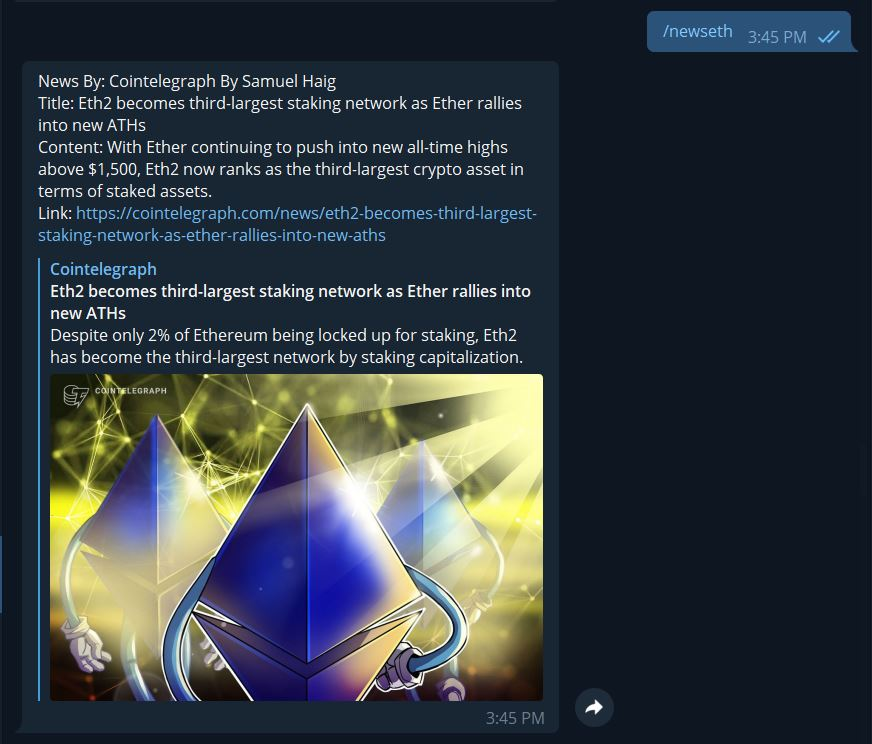

# LunoBlockChainBot
[LunoBlockChainBot] is a telegram cryptocurrency Bot created by deadrepo. You can check the current price of Bitcoin, Ethereum, Ripple, and Litecoins both in MYR and USD. Also with news features added and a funfacts about Bitcoins.

created by deadrepo

contact me for source code

donate me some ETH

0xa01A95878447dfbCdb47d85ed6898C1d241Af5d6⠀

How to run

1) create a folder 
2) open the folder and type at the terminal "npm init -y" to create a file called package.json
3) create another file called anything that you want which in my case app.js
4) create that damn /newbot at botfather and get that annoying API Key
5) add the API key at the file app.js that I gave here probably at line 11 :)
6) copy my package.json to your package.json. Actually step 2 is not needed, I just want you to learn  
7) okay now type "npm install --save". It will add the package inside package.json
8) node modules file and package-lock.json will be created
8) if it doesn't work do it manually such as "npm install telegraf --save"
9) to run the program basically type "node yourfilename.js"
10) Open your telegrambot at telegram and try the command

Some snapshot inside Telegram

//Price Command

//News Command

